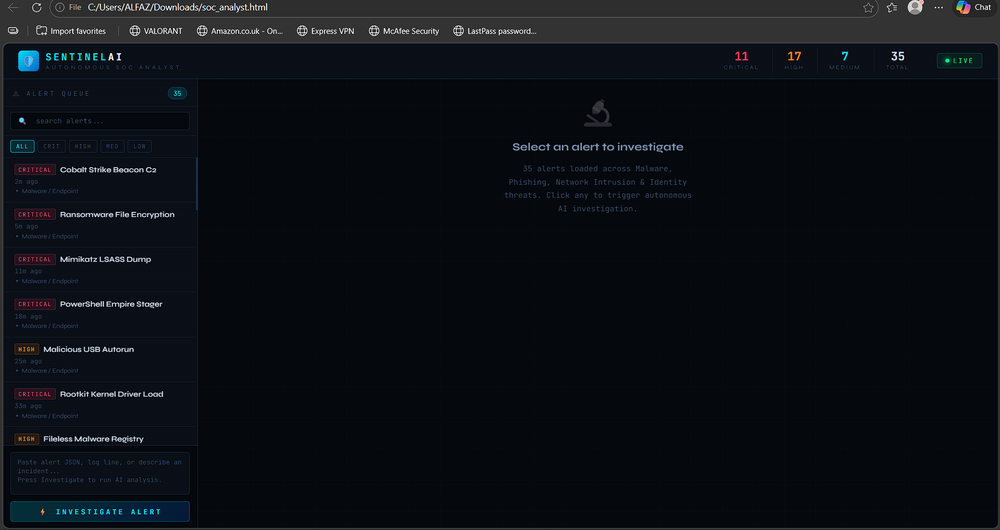
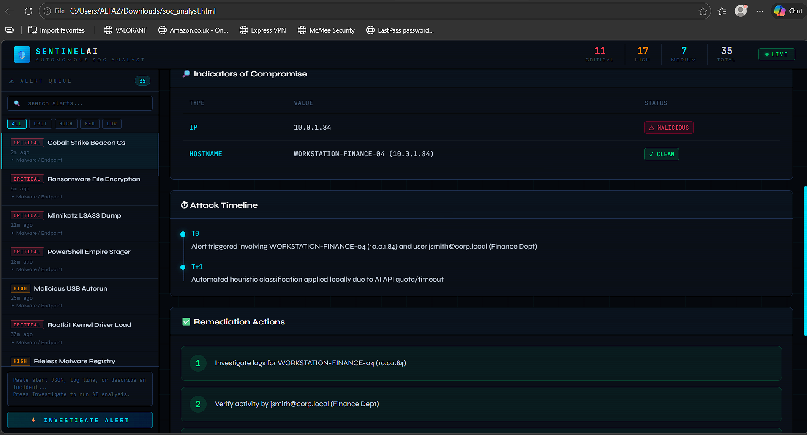

# 🛡️ SentinelAI — Autonomous SOC Analyst

Hi, I’m Alfaz 👋
This project is my attempt to simulate how a real SOC (Security Operations Center) analyst investigates security alerts.

Instead of just learning theory, I wanted to build something that actually *feels* like a real SOC dashboard — where alerts come in, get analyzed, and decisions are made.

🚀 Simulating real-world SOC investigations with MITRE ATT&CK mapping, alert triage, and incident response — built as a hands-on cybersecurity learning project.

---

## 🚀 What this project does

This system takes security alerts (like ransomware, credential dumping, C2 activity) and walks through how an analyst would investigate them.

For each alert, it:

* Assigns a verdict (malicious / suspicious)
* Maps it to MITRE ATT&CK techniques
* Shows possible indicators (IOCs)
* Builds a simple attack timeline
* Suggests what actions should be taken

---

## 💡 Why I built this

While learning cybersecurity, I noticed that:

* Most projects are either too theoretical
* Or too dependent on tools without understanding

So I built this to:

* Practice real-world SOC thinking
* Understand attack behavior deeply
* Simulate how investigations actually happen

---

## ⚔️ Scenarios covered

Some of the alerts included in this project:

* Cobalt Strike Beacon (C2 communication)
* Mimikatz LSASS credential dumping
* Ransomware file encryption
* Phishing attempts
* Lateral movement (SMB / RDP)

---

## 🧠 How it works (simple)

1. Pick an alert from the dashboard
2. The system analyzes it
3. Maps it to MITRE ATT&CK
4. Shows what might be happening
5. Suggests what to do next

---

## 🖥️ Screenshots

### Dashboard

### Investigation View

---

## 🛠 Tech used

* HTML, CSS, JavaScript
* Node.js + Express
* MITRE ATT&CK framework

---

## 📌 Note

This is a simulation project made for learning and demonstration.
It’s not connected to real SIEM tools or live environments.

---

## 🙌 About me

I’m currently focused on cybersecurity, especially SOC and blue team roles.
Still learning, building, and improving every day.

---
